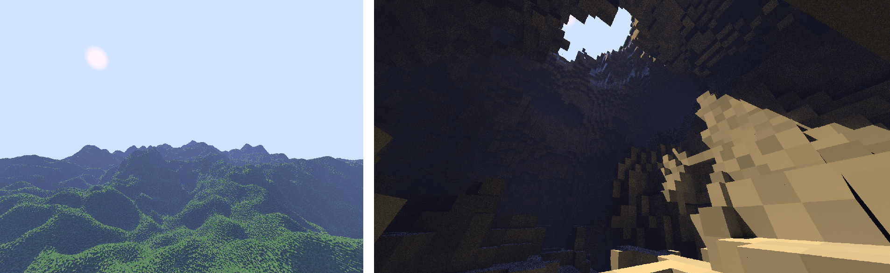

# Voxand
**Voxand is a GPU-accelerated voxel ray tracing engine** built from scratch using C#, .NET 8, and OpenGL 4.3. For UI elements, ImGui is supported.

**This is a personal project created to learn the fundamentals of graphics programming. It is not intended to be a production-ready game engine.**

## About
Voxand uses the **OpenTK** library to interact with OpenGL. The software ray tracing is implemented in **GLSL compute shaders**. It uses **per-pixel lighting** as opposed to per-voxel lighting.

#### Voxel Data
Voxels are stored in a **brickmap** data structure consisting of 4x4x4 voxel bricks. 
* **Each voxel stores 1 byte of information** used as an index in a **global material palette**. 
* Brick data is split into two lists:
    * **Material data**: Stores 64 bytes of information per brick (1 byte per voxel).
    * **Occupancy data**: Stores 8 bytes per brick (1 bit per voxel). 

During ray traversal, only the occupancy bitmask is read. The material buffer is accessed only once a ray confirms a hit, significantly **reducing memory bandwidth usage**.

#### Traversal
Voxand implements a hybrid ray casting algorithm on the GPU:
1. A **distance field** is used to skip empty space at the brick level (similar to sphere tracing).
2. **Hierarchical DDA**: When close to surface, the ray switches to Hierarchical DDA, stepping first through the brick grid and then through the voxel sub-grid within it.

#### Lighting
The renderer approximates global illumination with single-bounce diffuse lighting at 1 SPP:
1. Calculates 1 diffuse bounce and 1 sun shadow ray per pixel.
2. If the diffuse ray hits a surface, a second sun shadow ray is cast.

Since secondary ray directions are random, **Temporal Anti-Aliasing (TAA)** with **reprojection** is used to accumulate samples over time and reduce noise.

Finally, the image is upscaled as needed and post-processed.

**Note: Compatibility is currently very limited and visual glitches appear on many GPUs. Furthermore, the Temporal Anti-Aliasing implementation introduces its own aliasing, light leaking, and various stability issues on different devices.**

## Requirements
* Target framework: .NET 8.0
* Supported OS: Windows
* OpenGL version: 4.3 or higher

## License
This work is licensed under the **GNU Affero General Public License v3**. See [LICENSE](./LICENSE.txt) for more details.